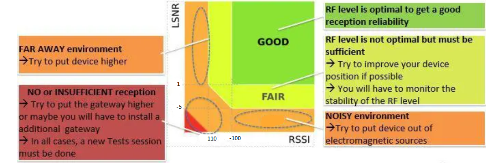

# LoRaWAN Log Analytics
## Table of Contents
- [LoRaWAN Log Analytics](#lorawan-log-analytics)
  - [Table of Contents](#table-of-contents)
  - [Introduction](#introduction)
  - [Functions log\_parsing](#functions-log_parsing)
    - [downloadlog](#downloadlog)
    - [txt\_to\_df](#txt_to_df)
    - [parse](#parse)
    - [analysis](#analysis)
    - [row\_style](#row_style)
    - [uploadFiles](#uploadfiles)
    - [sendReport](#sendreport)
  - [Configuration](#configuration)
  - [Running the Script](#running-the-script)
  - [Functions logAnalysis](#functions-loganalysis)

## Introduction
This document provides documentation for the Python script used for log parsing, analysis, and reporting. The script is designed to download log files from a remote server through SSH, parse the data, perform various analyses, and generate reports. Additionally, it supports uploading parsed files to a SharePoint folder and sending reports to a Microsoft Teams channel via a webhook.

## Functions log_parsing
These are the main functions that you need to call on the `main.py` to have the tool working properly

### downloadlog
The `downloadlog` function downloads log files from a remote server using SSH and SFTP, displaying a progress bar.

Parameters:

- `SERVER_ADDRESS`: The IP address or hostname of the server you want to connect to.
  
- `SERVER_PORT`: The port number used for the SSH connection with the server (default is 22).
  
- `SERVER_USERNAME`: The username used for server authentication.
  
- `SERVER_PASSWORD`: The password for server authentication.
  
- `REMOTE_FILE_PATH`: The path of the file on the remote server that you want to download.
  
- `LOCAL_DESTINATION`: The local destination where the downloaded file will be saved on your machine.

### txt_to_df
The `txt_to_df` function is designed to take a text file as input, read its lines, parse them as JSON objects, and create a pandas DataFrame with the extracted data. This function is crucial for converting raw log data into a structured format for further analysis. 

This is the only function that might need altering for a new project depending on the log files we receive and use. The output of this tool is supposed to be a dataframe with specific format so the reset of the tool can function properly. Each row of the DataFrame must contain they following information after this function is done:

| DevEUI | Timestamp(ISO) | fCnt | LRR SNR | LRR RSSI | dr/SpFact | Payload(hex) | Msg Type | Voltage | Temperature | Car Status | Version | Lrrid | Lrrs |
| -------- | -------- | -------- | -------- | -------- | -------- | -------- | -------- | -------- | -------- | -------- | -------- | -------- | -------- |

Parameters:
- `file`: The file parameter is a string that represents the path to the text file containing the data you want to convert to a DataFrame.

Returns:
- The txt_to_df function returns a pandas DataFrame `df_final`, which contains the processed data extracted from the input file. This DataFrame can then be used for various data analysis and reporting tasks.

The function performs the following steps:

1. Open the specified text file (file) and read its lines.
2. Parse each line as a JSON object and store them in a list called data.
3. Create an initial DataFrame df from the data list.
4. Perform necessary data transformations and renaming of columns.
5. Create additional columns in the DataFrame based on various data processing functions (base64tohex, parse, typeCheck, findVoltage, findTemp, findCARStatus, and findVersion).
6. Generate a final DataFrame df_final containing essential columns for analysis and reporting.
7. Convert the 'DevEUI' values to uppercase for consistency.
8. Return the resulting DataFrame df_final as the output of the function.

This function is a critical part of the log analysis pipeline, as it converts raw log data into a structured format that can be further analyzed and reported on.

### parse
The `parse` function processes data for a specific sensor, performs various analyses, and generates reports. It returns a pandas DataFrame with summary statistics.

Parameters:
- row: A row of data from a larger dataset, containing information about a specific sensor device.
- totaldf: A pandas dataframe containing all the data for all sensors.
- df_report: A pandas DataFrame that contains the report data for all the sensors that have been parsed so far. The function returns a new DataFrame that includes the data for the current sensor, which is then concatenated with the existing df_report.

Returns:

A pandas DataFrame that is the concatenation of the input DataFrame `df_report` and a new DataFrame `pd.DataFrame(data, index=[0])`.

The function performs the following steps:

1. Extracts relevant information about the sensor, such as the sensor's name and EUI.
2. Filters the data to include only records from the last month.
3. Performs various analyses.
4. Generates reports and writes them to text and CSV files.
5. Calculates and reports on the signal quality.
6. Reports on the number of join requests, packet loss, and downtime.
7. Calculates and reports on the percentage of time the sensor was operational.

### analysis
The `analysis` function processes a review dataset and the log data, generating detailed reports for each sensor and an overall statistical report.

Parameters:
- review: A pandas DataFrame containing information about sensors(Name, EUI, Start Date).
- data: A pandas DataFrame containing raw log data for all sensors.
- report_file: The file path where the report messages will be written.
- folder_path: The folder path where individual sensor reports and files will be saved.

The function performs the following steps:
1. Iterates through each sensor in the review dataset.
2. Calls the parse function for each sensor to generate individual reports.
3. Concatenates individual reports and writes them to an Excel file.
4. Highlights rows based on signal quality in the Excel report.
5. Checks for increased join requests, high packet loss, and downtime.
6. Sends report messages to Microsoft Teams via webhook.
7. Converts the log data to Excel format and uploads files to SharePoint.

### row_style
The row_style function defines the background color for rows in a pandas DataFrame based on the "Signal Quality" column.

Parameters
- `row`: The row being iterated over in the DataFrame.

Returns

The function returns a pandas series object that specifies the background color for the row. The background color is determined based on the "Signal Quality" value, following the diagram about LoRaWAN signal quality bellow:
<div align="center">
  
</div>

Here's a breakdown of how background colors are assigned:

    If "Signal Quality" is 'Fair', the background color is yellow.
    If "Signal Quality" is 'Bad', the background color is red.
    If "Signal Quality" is 'Good', the background color is green.
    If "Signal Quality" is 'Noisy Environment' or 'Far Environment', the background color is orange.

### uploadFiles
The `uploadFiles` function uploads all files in a specified folder to SharePoint (Usualy at the folder connected to the specific project on Teams e.g. Smart Parking) and appends a report message to a report text file.

Parameters:

- folder_path: The directory where the files that you want to upload to SharePoint are located.

The function performs the following tasks:
1. Deletes any existing Statistical_Report.xlsx file on SharePoint.
2. Retrieves a list of all files in the specified folder.
3. Iterates over the files and uploads each one to the designated folder on SharePoint.
4. Appends a report message indicating that the latest version of the logs is on SharePoint.

### sendReport
The `sendReport` function sends a report to a Microsoft Teams channel using a webhook. This function is useful for sending reports to a Microsoft Teams channel for easy team communication and collaboration.

Parameters:

- `report`: The file path of the report that you want to send. It should be a string representing the file path to the report text file.
- `webhook`: The webhook URL that serves as a connection point between your code and a Microsoft Teams channel.
  
The function performs the following tasks:
1. Reads the content of the report from the specified file.
2. Sends the report as a message to a Microsoft Teams channel using the provided webhook.

## Configuration
The script uses a config.json file to store various configuration settings. Ensure that this file is correctly configured before running the script.

Example config.json structure:
```bash 
{
    "server_credentials": {
        "SERVER_ADDRESS": "your_server_address",
        "SERVER_PORT": "22 or the appropriate port"
        "SERVER_USERNAME": "your_username",
        "SERVER_PASSWORD": "your_password",
        "REMOTE_FILE_PATH": "Path to the log file at the server"
    },
    "local_files": 
    {
        "LOCAL_DESTINATION": "local_destination_folder",
        "report_file": "report.txt",
        "logs_folder": "logs_folder_path",
        "webhook": "your_webhook_url"
    },
    "share_point": 
    {
        "user": "microsoft365_username",
        "password": "microsoft365_password",
        "url": "https://company.sharepoint.com",
        "site": "https://company.sharepoint.com/sites/company/",
        "doc_library": "Shared Documents/Example Project Name" 
    }
}
```
Also the `sensor_list.xlsx` must have the right information filled in on the columns **EUI** and **name**, while the column **Start Time** can be filled on a later stage with the timestamp we mark as starting date for colecting proper data.

## Running the Script
1. Ensure you have the required Python libraries installed.

2. Ensure you have configured the config.json accordingly and the sensor_list.xlsx have the right informations.

3. Make possible required changes on the txt_to_df code in order the Pandas Dataframe will have the necessary formating. 

4. You can run the script by executing it using a Python interpreter. For example, if your script is named log_analysis.py, you can run it as follows:
```bash 
python log_analysis.py
```
## Functions logAnalysis
The following is a fast description of the function on the logAnalysis library that perfoms all the analytics processes of the tool:

- `parse(row)`: This function parses a row of data and returns a string with parsed information based on the first two characters of the payload, identifying it as a reset, snooze, occupation, BLE, or error message.

- `typeCheck(row)`: This function checks the value of the MType column in a DataFrame and returns a corresponding message type, such as 'Join Request,' 'Join Accept,' 'ACK,' or specific payload-related types like 'Occupation' or 'TEST_TRANSMIT.'

- `findVoltage(row)`: This function searches for the string "V=" in the Payload Type column of a DataFrame and returns the voltage value if found, or an empty string if not.

- `findVersion(row)`: This function searches for the string "Version=" in the Payload Type column of a DataFrame and returns the version value if found, or an empty string if not.

- `findTemp(row)`: This function searches for the string "Temp=" in the Payload Type column of a DataFrame and returns the temperature value if found, or an empty string if not.

- `findCARStatus(row)`: If the payload type is 'Occupancy' or 'snooze,' this function searches for the CAR (Car Status) in the payload type string and returns it; otherwise, it returns an empty string.

- `AvgMaxMin(data)`: Calculates and returns the average, maximum, and minimum values from a list of numbers.
  
- `TempAnalysis(Temp)`: Computes the average, maximum, and minimum temperatures from a list of temperature values using the AvgMaxMin function.
  
- `VoltageAnalysis(Volt)`: Calculates the average, maximum, and minimum voltage values from a list of voltage data using the AvgMaxMin function.

- `AirTimeAnalysis(AirT)`: Determines the average, maximum, and minimum air times from a list of airtime values in microseconds using the AvgMaxMin function.
  
- `CheckOcc(row):` Checks if a row's "Msg Type" is "Occupation" and the "Car Status" is either "ON" or "OFF" and returns 1, 2, or 0 accordingly.

- `OccupationAnalysis(Occ):` Calculates the count of "ON" and "OFF" occupation occurrences in a column of a DataFrame using the CheckOcc function.

- `ChangesCount(data)`: Counts the occurrences of each unique value in a pandas series and returns the count for each value.

- `UpDownCount(data)`: Counts the occurrences of 0s and 1s in a pandas series, renames the index to "UpLinks" and "DownLinks," and returns the counts as a string.

- `sfQuality(row)`: Evaluates the "SpFact" value in a row to determine if it's "Good," "Decent," or "Bad" quality based on specific conditions.

- `RSSIQuality(row)`: Classifies the quality of the "LRR RSSI" based on conditions as "Good," "Decent," or "Bad."

- `SNRQuality(row)`: Assesses the quality of "LRR SNR" as "Good," "Decent," or "Bad" based on specific conditions.

- `SignalAnalysis(data)`: Provides the average, maximum, and minimum values for "SpFact," "LRR RSSI," and "LRR SNR" columns in a DataFrame, and analyzes the quality of each of these parameters.

- `SFPresentation(data)`: Plots a histogram of the spread factor ("SpFact") distribution for uplinks and downlinks in the provided DataFrame.

- `SFMQTPresentation(data)`: Generates a histogram of the "SpFact" column in the given DataFrame.
- `SignalPie(data, type)`: Produces a pie chart illustrating the quality of the signal (either "RSSI" or "SNR") in the DataFrame based on specified criteria.

- `ChangesChart(data)`: Counts the occurrences of different message types in a DataFrame column and visualizes the counts in a bar chart.

- `ChangesMQTTChart(data)`: Counts the occurrences of specific message types in a DataFrame column and displays the counts in a bar chart.
  
- `LiveSensors(data, list, dateRange)`: Analyzes live sensors' data and generates a plot of live sensors per day. It also identifies sensors that experienced downtime and saves this information to an Excel file.

- `LiveMQTTSensors(data, list, dateRange)`: Similar to the previous function but tailored to MQTT sensor data.

- `convertTuple(tup)`: Converts a tuple into a string with each element on a new line.

- `GatewaysUptime(data, dateRange)`: Analyzes gateway data and generates a plot of the number of live gateways per day.

- `Check_Snoozes(df`): Checks for time differences between snooze messages greater than 3 days and returns a list of such occurrences.

- `Out_of_order_Snoozes(df, sensor)`: Checks for out-of-order snooze messages in a DataFrame and prints sensor names and counts of such occurrences.

- `check_fCnt_growth_Chirp(df)`: Checks if the 'fCnt' column in a DataFrame is growing by one for LoRaWAN data. This is used to detected lost payloads.

- `check_fCnt_growth_Actility(df)`: Checks if the 'fCnt' column in a DataFrame is growing by one for Actility data. This is used to detected lost payloads.

- `fCountTotal(df)`: Calculates the total number of payloads sent by the specific sensor.
  
- `count_rejoins(df)`: Counts the occurrences of the value 0 in the 'fCnt' column. This way we can find the times a sensor has rejoined the network.

- `check_retransmission(df)`: Checks for retransmissions in data, where an identical message follows its original within a short time.

- `check_joins(df, name)`: Analyzes join request data to identify possible issues, such as multiple retransmissions and long periods of downtime.

- `RadioLevelAnalysis(avgRSSI, avgSNR)`: Analyzes average RSSI and SNR values to categorize radio signal quality.

- `errorCheck(df, report_file)`: Checks for malfunction payloads in sensor data and writes a report message to a text file if found.

- `resetReport(df, saveAs, report_file)`: Generates a report message containing timestamps of reset events in the data and saves it to a text file.

- `base64tohex(row)`: Decodes a Base64 string to bytes and converts them to a hexadecimal string.
